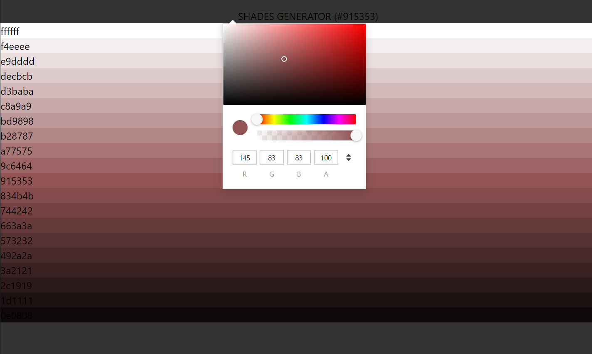

# TODO-LIST with reactjs & CSS & Tailwind

## Explanation to use

## Explanation of code

- library : values.js || https://noeldelgado.github.io/values.js/
- It's returns a different color shads while we give a color code.
- npm i values.js
- library : color pick : React Color chrome || https://www.npmjs.com/package/@uiw/react-color-chrome
- npm i @uiw/react-color-chorme
- error : npm view ionic-native to view the version
- npm i @uiw/react-color-chrome try again.
- This is for the color picker.
- library : react-copy-to-clipboard || https://www.npmjs.com/package/react-copy-to-clipboard
- npm i react-copy-to-clipboard
- To work dynamic with color we're using useState
- ChromeColor showed in the browser. with calling ChromeColor color={}. It came from library.

- We are trigger a method while triggering the onChange event in ChromeColor.

- With this color we're creating different type of shades. with help of Values library.
- We put that color in array.
- new Values(color.hex) => we can access different type of functions.
- colorValues.all => it's increase the weight of the color we're passing. 
- Starting: white and ending: black and in between different shads of the chosen color.

- newColor.pop using to remove the last element of the array.
- to use on the grid layers 20 would be nice to divide by 4 = 5 in a row.
- That 20 shades applied in setShades.
- In the shades-list we're mapping each values of the shades, returning a li

- Using grid for rows and colms

- With the help of ReactCopyToClipboard library we can copy the color code while clicking on the color box.
- ex: #675555 by click and paste
- 

 

## Learning purpose

### JS Cookies vs local storage vs Session

